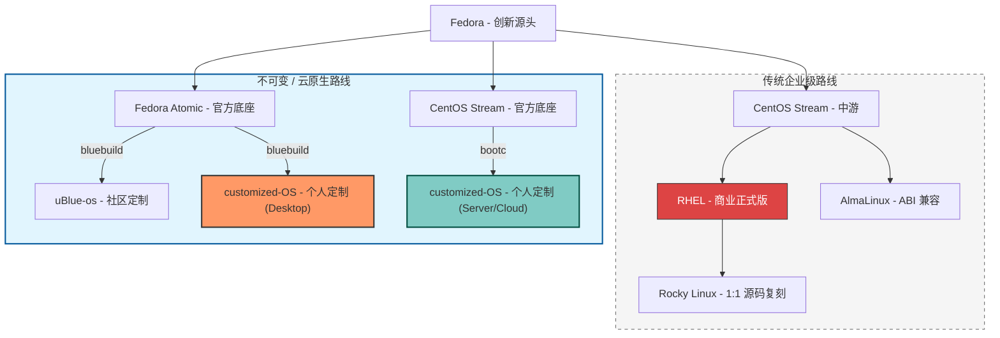

# 两个方案

```mermaid
graph TD
    %% 定义顶级源头
    A["Fedora - 创新源头"]

    %% 传统企业级路线框
    subgraph Traditional ["传统企业级路线"]
        B["CentOS Stream - 中游"]
        C["RHEL - 商业正式版"]
        D["AlmaLinux - ABI 兼容"]
        E["Rocky Linux - 1:1 源码复刻"]
        
        B --> C
        B --> D
        C --> E
    end

    %% 不可变路线框
    subgraph Atomic ["不可变 / 云原生路线"]
        F["Fedora Atomic - 官方底座"]
        J["CentOS Stream - 官方底座"]
        G["uBlue-os - 社区定制"]
        H["customized-OS - 个人定制 (Desktop)"]
        I["customized-OS - 个人定制 (Server/Cloud)"]
        
        F -- bluebuild --> G
        F -- bluebuild --> H
    end

    %% 建立顶级连接与 bootc 定制分支
    A --> B
    A --> J
    A --> F
    J -- bootc --> I

    %% 样式美化（可选，增加区分度）
    style Traditional fill:#f5f5f5,stroke:#666,stroke-dasharray: 5 5
    style Atomic fill:#e1f5fe,stroke:#01579b,stroke-width:2px
    style H fill:#f96,stroke:#333,stroke-width:2px
    style I fill:#80cbc4,stroke:#004d40,stroke-width:2px
    style C fill:#d44,stroke:#333,color:#fff
```
